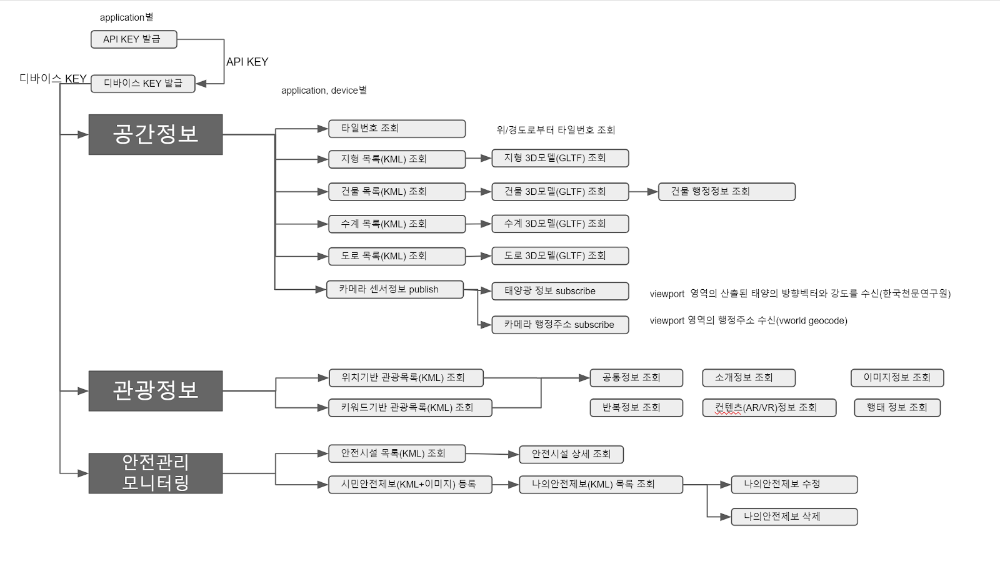

# 디지털트윈 API specification

디지털트윈 플랫폼은 쉽게 실감형 컨텐츠를 제작할 수 있도록 아래와 같은 OpenAPI 서비스를 제공합니다. 

* 다양한 공간정보 제공(지형,건물,하천,도로,건물행정정보등)
* Tour API3.0기반 관광정보와 더불어 다양한 AR/VR 컨텐츠와 관광객에 대한 행태분석제공
* 각 관광지에 대한 안전시설정보 및 안전제보 기능 제공 
* 공간 정합을 위한 KML언어 지원(구글 어스와 호환)
* 언리얼, 유니티, WebGL와 같은 3D엔진에서 3D모델을 표현할 수 있도록 상호운용성이 뛰어난 GLTF포멧 지원(현재 Vworld는 자체포멧 XDO 제공.)
* AR / VR / Mobile APP / WebGl 카메라 센서정보 통신(publish)하여 위치기반 데이터(날씨, 관광이벤트, 안전정보등)를 실시간 제공(subscribe)받을 수 있도록 사물인터넷 기반 mqtt 프로토콜 채용.

# 디지털트윈 제공 서비스

디지털트윈 OpenAPI에서 제공하는 서비스 내용은 아래와 같습니다.

